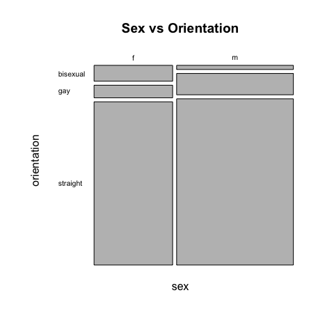

# OkCupid Profile Data for Intro Stats and Data Science Courses
Albert Y. Kim and Adriana Escobedo-Land  

Data and code for "OkCupid Profile Data for Introductory Statistics and Data Science Courses":

* `JSE.bib`:  bibliography file
* `JSE.pdf`:  PDF of document
* `JSE.Rnw`:  R Sweave document to recreate `JSE.pdf`
* `JSE.R`:  R code used in document
* `okcupid_codebook.txt`:  codebook for all variables
* `profiles.csv.zip`: CSV file of profile data (unzip this first)

## Preview

### Distribution of Male and Female Heights

 

### Joint Distribution of Sex and Sexual Orientation

A mosaicplot of the cross-classification of the 59946 users' sex and sexual orientation:  

 

### Logistic Regression to Predict Gender

Linear regression (in red) and logistic regression (in blue) compared.  Note both the $x$-values (height) and $y$-values (is female: 1 if user is female, 0 if user is male) have random jitter added to better visualize the number of points involved for each (height, gender) pair.

 

Fitted probabilities $\widehat{p}_i$ of each user being female along with decision threshold $p^*$ (in red) used to predict if user is female or not.  

 

